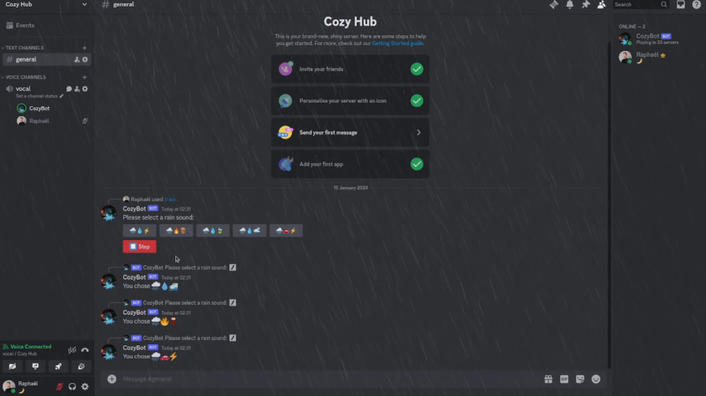

# 🛋️ CozyBot

Welcome to CozyBot, a discord.py bot designed to bring cozy and peaceful ambiences to your Discord voice channels. Our aim is to provide peace of mind and tranquility to Discord users.

## 👥 Developed By

- **Raphaël MARTIN** - [@kitsuiwebster](https://github.com/kitsuiwebster)
- **Imène MEDJAOUI** - [@BubbleXGum](https://github.com/imenemedjaoui)

## ✅ Features

*Commands summon CozyBot to your voice channel.*

### 🌧️ Rain

Use the `/rain` command to immerse yourself in the soothing sound of rain. Choose the rain ambience that best suits your mood.

### ✨ Sparkles

Use the `/sparkles` command to bring a magical, glittering effect to your chat.

### 🌊 Sea

Use the `/sea` command to enjoy the calming sounds of ocean waves. Perfect for relaxation or as a peaceful background sound.

### 🎶 Background Music

Use the `/music` command to play background music. Select from a variety of genres to enhance your mood or complement your activities.

*You have the freedom to stop or change any sound ambiance whenever you desire.*

## 📥 Get CozyBot on Your Server

- [Invite CozyBot to your Discord server](https://discord.com/api/oauth2/authorize?client_id=1156917047284994178&permissions=40550970817344&scope=bot)

## 📅 Future Plans

We are working to improve CozyBot and add more features. Stay tuned for more cozy ambiences!

## 🐞 Report a bug

- [Join our Support Discord server](https://discord.gg/Rxeh64Y73U)

## Short video presentation

