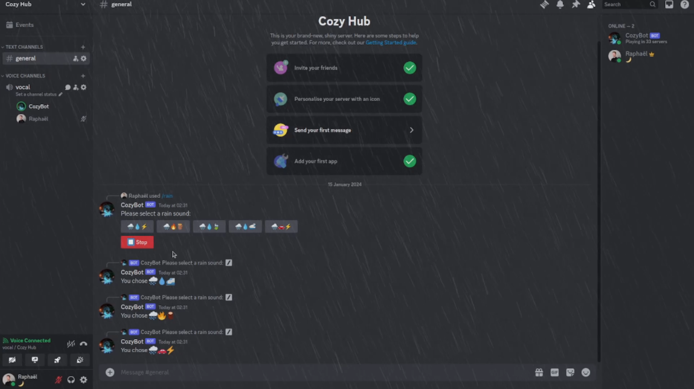

# CozyBot v2.0.0

  
  
  
  
  

Welcome to CozyBot, a discord.py bot designed to bring cozy and peaceful ambiences to your Discord voice channels. Our aim is to provide peace of mind and tranquility to Discord users.

## 📥 Get CozyBot on Your Server

### Direct Link

- [Invite CozyBot to your Discord server](https://discord.com/api/oauth2/authorize?client_id=1156917047284994178&permissions=40550970817344&scope=bot)

### App Directory

CozyBot is also available in the official Discord App Directory:
- [CozyBot on Discord App Directory](https://discord.com/discovery/applications/1156917047284994178)

## ✅ Features

*Commands summon CozyBot to your voice channel.*

### 🌧️ Rain

Use the `/rain` command to immerse yourself in the soothing sound of rain. Choose the rain ambience that best suits your mood.

### ✨ Sparkles

Use the `/sparkles` command to bring a magical, glittering effect to your chat.

### 🌊 Sea

Use the `/sea` command to enjoy the calming sounds of ocean waves. Perfect for relaxation or as a peaceful background sound.

### 🎶 Background Music

Use the `/music` command to play background music. Select from a variety of genres to enhance your mood or complement your activities.

### 🛑 Stop

Use the `/stop` command to stop any currently playing sound or music in the voice channel.

### 🏆 Gamification System

CozyBot now includes a comprehensive gamification system to track your listening experience:

- **`/profile`** - View your personal stats, level, achievements, and listening time
- **`/top-users`** - See the leaderboard of top CozyBot users by points
- **`/top-servers`** - Display the top servers by time spent with CozyBot
- **`/achievements`** - View all available achievements and your progress

Earn points by listening to sounds, unlock achievements, and compete with other users!

*You have the freedom to stop or change any sound ambiance whenever you desire.*

## 📅 Future Plans

We are working to improve CozyBot and add more features. Stay tuned for more cozy ambiences!

## 🐞 Report a bug

- [Join our Support Discord server](https://discord.gg/Rxeh64Y73U)

## Short video presentation

## 📄 License

This project is licensed under the MIT License - see the [LICENSE](LICENSE) file for details.

## 👥 Developed By

- **Raphaël MARTIN** - [@kitsuiwebster](https://github.com/kitsuiwebster)
- **Imène MEDJAOUI** - [@BubbleXGum](https://github.com/imenemedjaoui)
