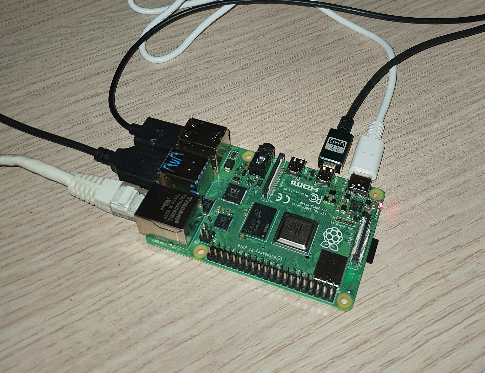
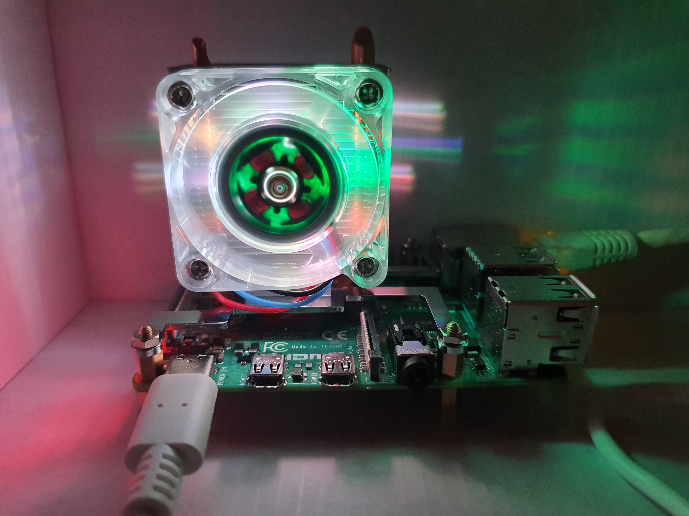
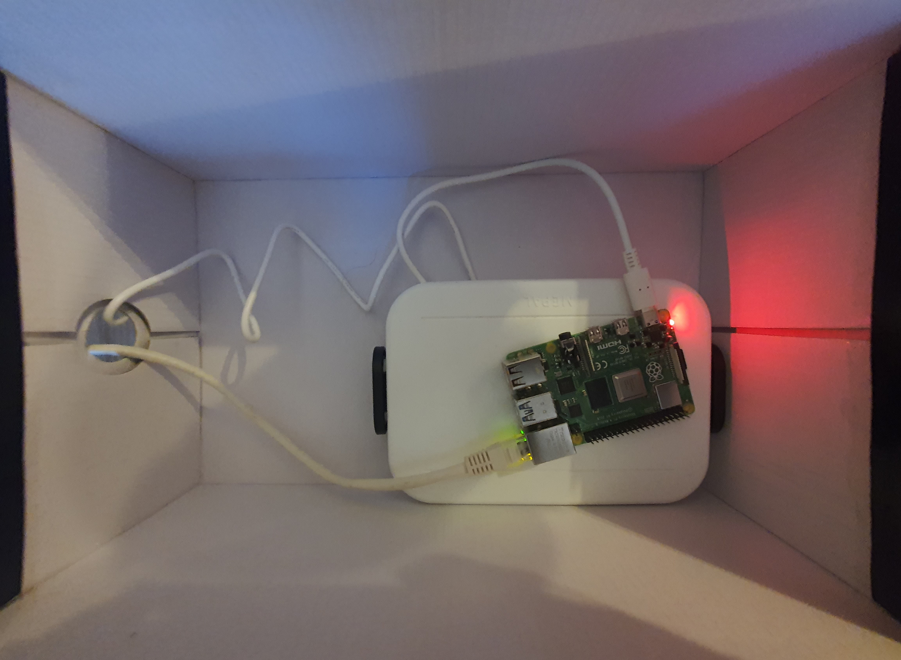

# Bringing Coziness to Discord: The Journey of CozyBot

## Introduction

Welcome to the journey of CozyBot, a unique creation designed to enhance the ambiance of Discord communities. Meet CozyBot, our delightful discord.py bot that's on a mission to sprinkle a dash of coziness over the vast lands of Discord servers. Imagine this: soft, fluffy clouds of comfort drifting into your voice channels, carrying the soothing sounds of rain, the enchanting whispers of the wind, and the magical sparkle of distant stars right to your digital doorstep. That's CozyBot for you, a wizard in the art of creating serene vibes and peaceful corners in the bustling metropolis of Discord.

Why did we conjure up CozyBot, you ask? Picture this: Discord communities, buzzing with life, laughter, and endless conversations. Yet, amidst this vibrant chaos, there lay a silent wish for a serene sanctuary, a cozy nook where one could unwind, kick back, and breathe in the tranquility. We saw that wish, waved our magic wand (well, more like our coding skills), and voilà! CozyBot was born, ready to infuse your Discord experience with calm, comfort, and a touch of enchantment.

But wait, there's more! CozyBot isn't just about bringing peace and quiet to your servers. It's about transforming them into havens of happiness and hubs of harmony. Whether you're looking to create the perfect backdrop for your study sessions, add a cozy ambiance to your gaming nights, or simply enjoy a moment of quiet amidst the chaos, CozyBot is here to make every Discord moment a little more special, a little more serene, and a whole lot cozier. Let's embark on this cozy journey together and turn the digital space into our very own paradise of peace !

## The Technical Backbone

- **Introduction to the Technical Stack**: CozyBot is powered by a combination of libraries and technologies meticulously selected to enhance Discord servers with ambient sounds and interactive features.

- **discord.py**: A Python library for interacting with the Discord API, enabling CozyBot to connect to and communicate within Discord servers efficiently.

- **aiohttp**: An asynchronous HTTP client/server framework in Python, used by CozyBot for non-blocking HTTP requests, essential for fetching external data swiftly.

- **ffmpeg**: A multimedia framework that CozyBot utilizes to process audio and video content, enabling the bot to stream high-quality media in voice channels.

- **Importance of Each Library**:
  - **discord.py** provides the core functionality for bot interaction within Discord.
  - **aiohttp** ensures efficient, asynchronous web requests.
  - **ffmpeg** allows for the manipulation and streaming of multimedia content.
  - The additional libraries, **PyNaCl** and **python-dotenv**, enhance security and configuration management, respectively. Collectively, these components are crucial for CozyBot’s performance, security, and feature set.

## Development Process

### Production and Preprod

CozyBot's development and deployment strategy utilizes a dual-bot system, consisting of two distinct environments: pre-production (preprod) and production. Each environment is powered by its own Discord bot instance.

- **Pre-production Bot**: This bot operates in the preprod environment, serving as a dedicated testing ground for new features and updates. It allows us to thoroughly test stability, performance, and compatibility in a closed setting that simulates the live environment without affecting end users. This strategic approach enables the team to identify and resolve potential issues, ensuring only the most polished features make their way to the live bot.

- **Production Bot**: The production bot is the live version that interacts with the broader Discord community. It runs in the production environment, where tested and vetted features from the preprod bot are deployed. This bot is responsible for delivering the cozy experience to users, with all features having passed rigorous preprod testing to ensure reliability and user satisfaction.

By maintaining these two separate bots, CozyBot effectively mitigates risks and enhances the quality of updates deployed to the Discord communities. This dual-bot strategy underscores the commitment to providing a stable and engaging user experience, making the transition from preprod to production smooth and controlled.

### MiniForge

MiniForge is the chosen tool for its simplicity and efficiency in managing environments and dependencies for CozyBot. It facilitates the creation of isolated environments, enabling seamless management of different versions or sets of dependencies. This approach significantly streamlines the development process, reducing the risk of dependency conflicts. Opting for MiniForge is especially beneficial for maintaining the bot's stability while exploring new features or updates.

The decision to choose MiniForge instead of Miniconda was driven by two main factors. Firstly, Miniconda does not support the aarch64 architecture of the Raspberry Pi, which is essential for ensuring CozyBot's compatibility and optimal performance on this platform. Secondly, MiniForge's community-driven nature aligns with our values and ensures that the tool stays up-to-date and responsive to the needs of developers like us, who rely on open-source solutions.

### Raspberry Pi 'Guess'

The Raspberry Pi 4B 8GB model is an excellent choice for hosting a Discord bot like CozyBot due to its compact size, cost-effectiveness, and energy efficiency. These features make it ideal for running continuously 24/7 without incurring high operational costs or requiring extensive physical space. Its robust processing power and ample memory capacity ensure that it can handle the computational demands of managing Discord interactions and processes efficiently, making it a high-performance yet affordable solution for Discord bot hosting.

*The initial setup of the Raspberry Pi 'Guess', showcasing its compact and efficient design before the cooling upgrade.*

#### Cooling Solution: Ice Tower

Maintaining optimal temperature is essential for the Raspberry Pi when running resource-intensive applications like CozyBot, particularly as the number of users increases. Overheating can lead to performance bottlenecks, affecting the bot's responsiveness and reliability. To circumvent this issue, equipping the Raspberry Pi with a cooling solution, such as the 'Ice Tower,' is advisable. This approach significantly lowers the temperature from a risky 50°C to a stable 27°C, enhancing performance and ensuring the device can handle high CPU loads smoothly. This preventative measure is key to ensuring CozyBot operates efficiently, regardless of user demand, and extends the hardware's durability by avoiding heat-related stress.

*The Raspberry Pi 'Guess' equipped with the Ice Tower cooling system, significantly reducing temperatures for optimal performance.*

#### The box

The Raspberry Pi resides in a specialized enclosure, ensuring its components are protected while maintaining optimal airflow for cooling. As a touch of personalization, the Raspberry Pi has been affectionately named 'Guess', adding a bit of character and humor to the development setup. You know why 'Guess', because 'Guess what's inside the box?'

*The Raspberry Pi 'Guess' (without the Ice Tower), housed in its protective enclosure, showcasing the personalized setup for CozyBot.*

### Screen and SSH

Screen and SSH are invaluable tools in CozyBot's development and maintenance, allowing for remote operation and management. `Screen` enables running sessions in the background, ensuring CozyBot continues to operate even when the connection is closed. `SSH` provides secure remote access to the Raspberry Pi, facilitating updates, troubleshooting, and monitoring from any location.

### DMZ and Network Architecture

Incorporating a Demilitarized Zone (DMZ) within the network architecture significantly enhances CozyBot's security. Hosting CozyBot on a Raspberry Pi at my home necessitates stringent measures to protect the private network from potential external threats. By placing the Raspberry Pi in a DMZ, it is effectively isolated from the internal network. This strategic separation limits the bot’s exposure to direct internet traffic and potential vulnerabilities, ensuring that, even in the event of a compromise, the impact on the internal network is significantly minimized. This setup is crucial for safeguarding sensitive data and the infrastructure of my home network, providing an added layer of security while allowing CozyBot to operate seamlessly and safely.

## Community Engagement and Open Source

### Building a Cozy Community

The role of user feedback in CozyBot's development cannot be overstated. Each comment, suggestion, and piece of feedback is a valuable asset in the continuous improvement cycle of CozyBot. Regular updates and feature rollouts are often direct responses to community input, demonstrating a commitment to evolving CozyBot in ways that best serve its users. This iterative process not only enhances existing features but also guides the introduction of new ones, keeping the bot fresh and relevant.

### Embracing Open Source

CozyBot proudly embraces its open-source nature, standing on the principles of collaboration, transparency, and shared innovation. By making its codebase accessible to all, CozyBot invites developers and tech enthusiasts to contribute to its growth, whether through adding new features, refining existing ones, or fixing bugs.

Open-sourcing CozyBot comes with its own set of benefits and challenges. Managing an open-source project requires diligent oversight to maintain code quality, ensure security, and integrate contributions seamlessly. The balance between harnessing the power of community contributions and upholding high standards of development is a continuous journey for CozyBot.

### Discord Server

Welcome to our cozy corner of the internet! We've whipped up a special Discord server that's open to all – a bustling playground where you can chat up the development team, hunt for bugs or pitch your brilliant feature ideas. It's not just any server; it's where you get to meet CozyBot in its natural habitat, basking in the glow of cozy vibes and spreading the calm across Discord lands.

Whether you're here to lend a hand, toss in a two cents, or just soak up the ambiance, our Discord server is your cozy clubhouse. Come join the party, mingle with the family, and help us knit the fabric of CozyBot's future. Everyone's invited, and the door's always open. Let's make this journey together !

- [Feel free to join our Discord Server](https://discord.gg/Rxeh64Y73U)

## Conclusion

As we continue to journey through the ever-evolving landscape of CozyBot, our sights are set on a horizon filled with new features, enchanting ambiances, immersive soundscapes, and innovative commands. The canvas of CozyBot is vast, and we're painting it with the colors of creativity and community feedback, ensuring each stroke adds more depth and vibrancy to your Discord experience.

This description paints the current setup of CozyBot, a snapshot in time of our dedication and hard work. Yet, like any great project, it's subject to change, growing and adapting with the evolution of our community and the expansion of our ambitions.

So, stay tuned... and stay cozy !

Oh, and here is the invitation to bring peace to your Disord Serevr: [Bring me to your land !](https://discord.com/api/oauth2/authorize?client_id=1156917047284994178&permissions=40550970817344&scope=bot)